## Envio de correos

1. Ve a administracion de tu cuenta de Google

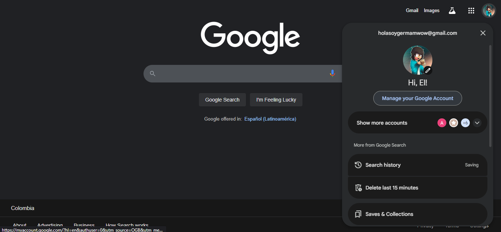

2. Ve a Seguridad

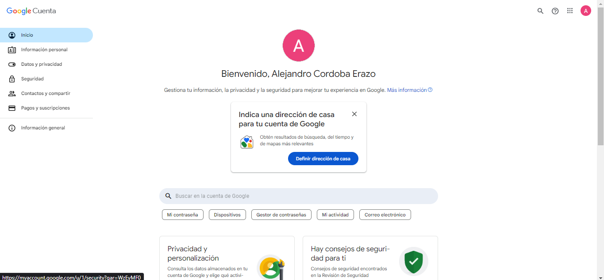

3. Ve a activar verificación en 2 pasos y activala

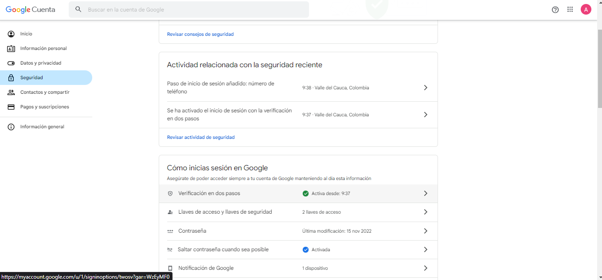

4. Ve a administracion de tu cuenta de Google y busca 'Contraseñas de aplicación'

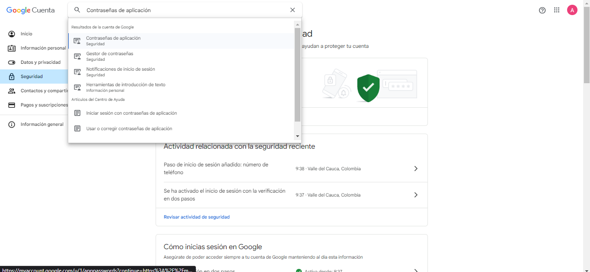

5. Crea tu aplicación SMTP

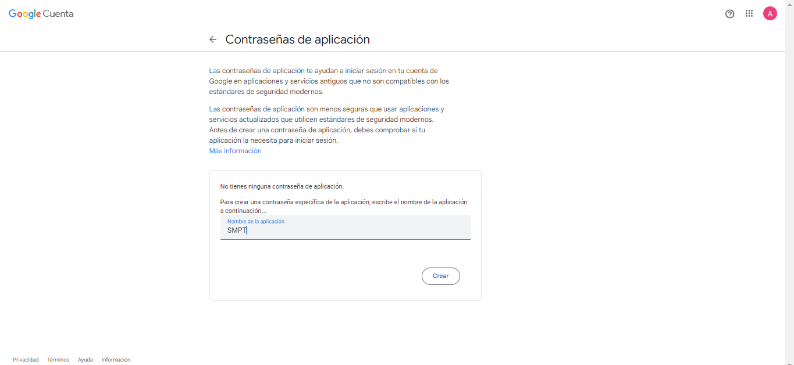

6. Guarda la clave generada

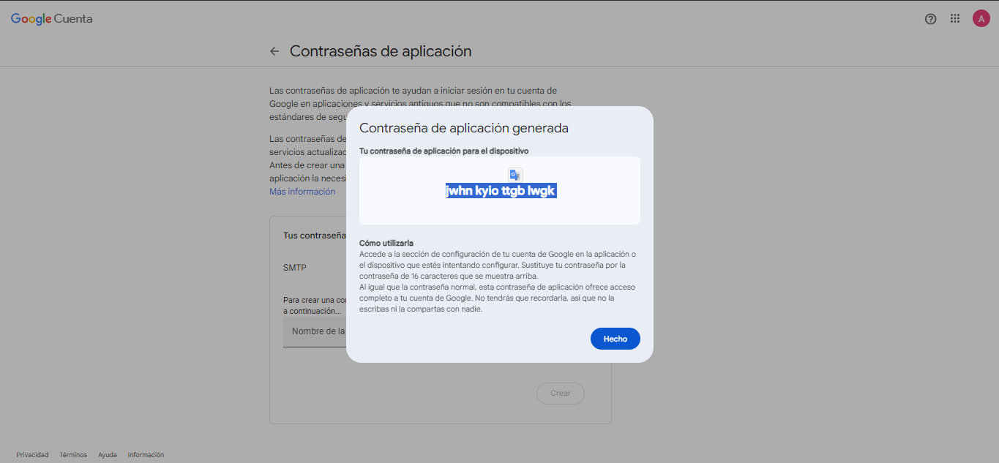

7. agrega estos valores en tu ```settings.py```

```py
EMAIL_BACKEND = 'django.core.mail.backends.smtp.EmailBackend'
EMAIL_HOST = 'smtp.gmail.com'  
EMAIL_PORT = 587 
EMAIL_USE_TLS = True 
EMAIL_HOST_USER = 'tu_correo@gmail.com' 
EMAIL_HOST_PASSWORD = 'jwhn kyio ttgb lwgk' 
DEFAULT_FROM_EMAIL = EMAIL_HOST_USER
```

en mi caso

```py
EMAIL_BACKEND = 'django.core.mail.backends.smtp.EmailBackend'
EMAIL_HOST = 'smtp.gmail.com'  
EMAIL_PORT = 587 
EMAIL_USE_TLS = True 
EMAIL_HOST_USER = 'alejandrocordobaerazo@gmail.com' 
EMAIL_HOST_PASSWORD = 'jwhn kyio ttgb lwgk' 
DEFAULT_FROM_EMAIL = EMAIL_HOST_USER

```
8. Puedes enviar un correo en cualquier vista usando este metodo

```py
from django.core.mail import send_mail

send_mail(
    'Asunto del correo',
    'Este es el contenido del correo.',
    'tu_correo@gmail.com',  # Remitente (debe coincidir con EMAIL_HOST_USER)
    ['destinatario@gmail.com'],  # Lista de destinatarios
    fail_silently=False,
)

```

9. Crea la vista ```send_email_view```

```py
def send_email_view(request):
    if request.method == 'POST':
        subject = request.POST.get('subject', '')
        message = request.POST.get('message', '')
        recipient = request.POST.get('recipient', '')

        if subject and message and recipient:
            try:
                send_mail(subject, message, 'tu_correo@gmail.com', [recipient])
                messages.success(request, '¡Correo enviado exitosamente!')
            except Exception as e:
                messages.error(request, f'Error al enviar el correo: {e}')
        else:
            messages.error(request, 'Todos los campos son obligatorios.')

        return redirect('send-email')

    return render(request, 'send_email.html')

```

10. Agrega los imports necesarios

```py
from django.shortcuts import render, redirect
from django.core.mail import send_mail
from django.contrib import messages
```

11. Agrega la template ```send_email.html```

```html



<div class="container mt-5">
    <h2>Enviar Correo</h2>

    
        <div class="alert-container">
            
                <div class="alert alert-{{ message.tags }} alert-dismissible fade show" role="alert">
                    {{ message }}
                    <button type="button" class="btn-close" data-bs-dismiss="alert"></button>
                </div>
            
        </div>
    

    <form method="POST">
        

        <div class="mb-3">
            <label class="form-label">Asunto:</label>
            <input type="text" name="subject" class="form-control" required>
        </div>

        <div class="mb-3">
            <label class="form-label">Mensaje:</label>
            <textarea name="message" class="form-control" rows="5" required></textarea>
        </div>

        <div class="mb-3">
            <label class="form-label">Destinatario:</label>
            <input type="email" name="recipient" class="form-control" required>
        </div>

        <button type="submit" class="btn btn-primary">Enviar Correo</button>
    </form>
</div>


```

12. Agrega la ruta en ```urls.py```

```py
path('send-email/', views.send_email_view, name='send-email'),
```

13. En tu ```base.html``` agrega un enlace en el sidebar

```html
<a href="">Enviar Correo</a>
```

14. Ve a ```http://127.0.0.1:8000/``` y ve a la opción Enviar correo

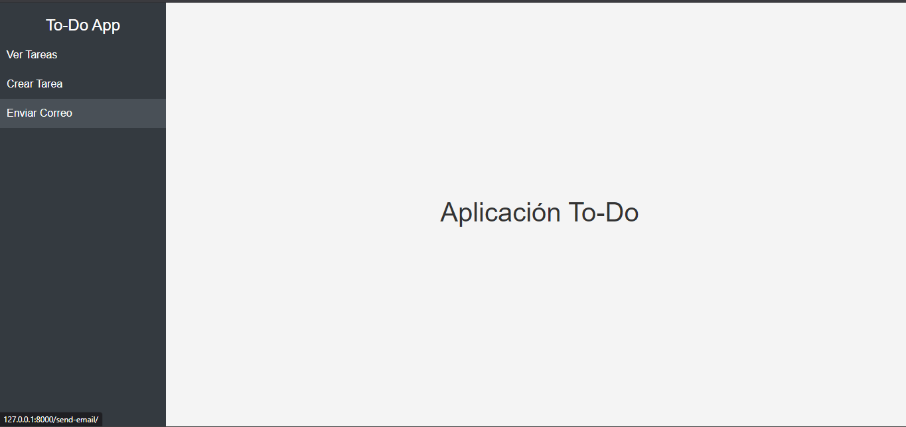

15. Llena los datos y dale enviar

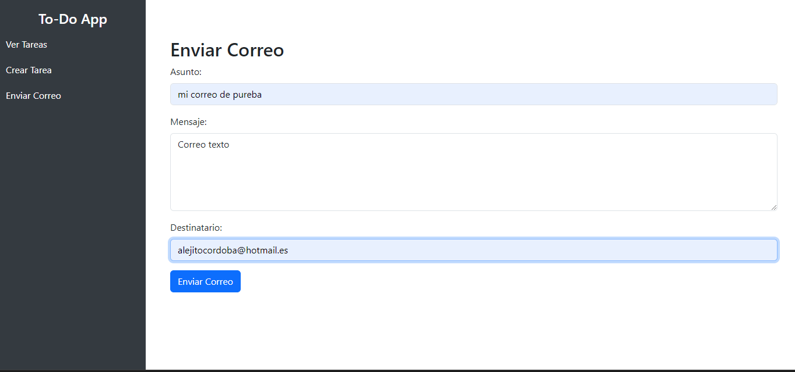

16. Revisa que llegó el correo, puede llegar a spam

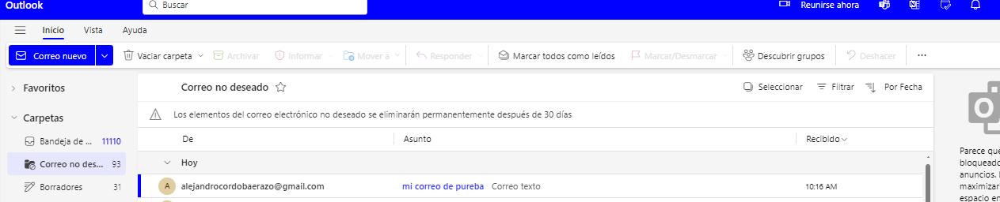

## Autenticación

### login

1. Configurar la autenticacion en ```settings.py```

```py
LOGIN_URL = "login" #ruta del login
LOGIN_REDIRECT_URL = "list-tasks"  # Redirigir al usuario tras login
LOGOUT_REDIRECT_URL = "login"  # Redirigir al login tras logout
```

2. agregar vistas para la autenticación (login y logout)

```py
from django.contrib.auth import authenticate, login, logout
from django.shortcuts import render, redirect
from django.contrib.auth.decorators import login_required
from django.contrib import messages
from django.contrib.auth.models import User

def user_login(request):
    if request.method == "POST":
        username = request.POST.get("username")
        password = request.POST.get("password")
        user = authenticate(request, username=username, password=password)
        
        if user:
            login(request, user)
            return redirect("list-tasks")  # Redirige a la lista de tareas
        else:
            messages.error(request, "Usuario o contraseña incorrectos")
    
    return render(request, "login.html")

def user_logout(request):
    logout(request)
    return redirect("login")

```

2. Crear formulario de login con ```login.html``` en la carpeta ```templates/auth```

```html



<div class="container mt-5">
    <div class="row justify-content-center">
        <div class="col-md-6">
            <h2 class="text-center">Iniciar Sesión</h2>
            
                
                    <div class="alert alert-{{ message.tags }}">{{ message }}</div>
                
            
            <form method="post">
                
                <div class="mb-3">
                    <label class="form-label">Usuario</label>
                    <input type="text" name="username" class="form-control" required>
                </div>
                <div class="mb-3">
                    <label class="form-label">Contraseña</label>
                    <input type="password" name="password" class="form-control" required>
                </div>
                <button type="submit" class="btn btn-primary w-100">Ingresar</button>
            </form>
            <p class="text-center">¿No tienes cuenta? <a href="">Regístrate</a></p>
        </div>
    </div>
</div>


```

3. Proteger todas las demás vistas de tareas
```py
from django.contrib.auth.decorators import login_required

@login_required
def list_tasks(request):
    tasks = Task.objects.all()
    return render(request, "list_tasks.html", {"tasks": tasks})
```

4. Agregar la ruta y eliminamos la ruta de home, ahora el home será nuestro login

```py
    path("", views.user_login, name="login"),
```

### registro

1. agregar ```register.html``` en ```templates/auth```

```html



<div class="container mt-5">
    <div class="row justify-content-center">
        <div class="col-md-6">
            <h2 class="text-center">Registro</h2>
            
                
                    <div class="alert alert-{{ message.tags }}">{{ message }}</div>
                
            
            <form method="post">
                
                <div class="mb-3">
                    <label class="form-label">Usuario</label>
                    <input type="text" name="username" class="form-control" required>
                </div>
                <div class="mb-3">
                    <label class="form-label">Correo Electrónico</label>
                    <input type="email" name="email" class="form-control" required>
                </div>
                <div class="mb-3">
                    <label class="form-label">Contraseña</label>
                    <input type="password" name="password1" class="form-control" required>
                </div>
                <div class="mb-3">
                    <label class="form-label">Confirmar Contraseña</label>
                    <input type="password" name="password2" class="form-control" required>
                </div>
                <button type="submit" class="btn btn-primary w-100">Registrarse</button>
            </form>
            <p class="text-center mt-3">¿Ya tienes una cuenta? <a href="">Inicia sesión</a></p>
        </div>
    </div>
</div>

```

2. Crear la vista

```py
def register(request):
    if request.method == "POST":
        username = request.POST["username"]
        email = request.POST["email"]
        password1 = request.POST["password1"]
        password2 = request.POST["password2"]

        if password1 != password2:
            messages.error(request, "Las contraseñas no coinciden")
        elif User.objects.filter(username=username).exists():
            messages.error(request, "El usuario ya existe")
        else:
            user = User.objects.create_user(username=username, email=email, password=password1)
            login(request, user)
            messages.success(request, "¡Registro exitoso!")
            return redirect("list-tasks")

    return render(request, "auth/register.html")
```

3. Añadir la ruta en ```urls.py```

```py
path("register/", views.register, name="register"),
```

### logout

1. crear la vista

```py
def user_logout(request):
    logout(request)
    messages.success(request, "Sesión cerrada correctamente")
    return redirect("login")
```

2. Añadir la ruta

```py
    path("logout/", views.user_logout, name="logout"),
```

3. Añadir en el sidebar esta lógica para mostrar el boton solo si esta logueado

```html
            
                <div class="logout-btn">
                    <form action="" method="post">
                        
                        <button type="submit" class="btn btn-danger w-100">Cerrar Sesión</button>
                    </form>
                </div>
            
```

## Autorización

Ahora vamos a crear la autorizacion

Django tiene grupos y permisos listos para usar:

**Grupos:** Son conjuntos de permisos. Puedes agrupar usuarios bajo un rol ("Admin", "Usuario Normal").


**Permisos:** Son acciones específicas que los usuarios pueden o no hacer ("Puede agregar tareas", "Puede editar tareas").
 
1. Crear los roles en admin.py, tienes que ir a ```http://localhost:8000/admin/``` y vamos a darle a
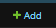

en ```Groups``` y vamos a crear el Group ```user```

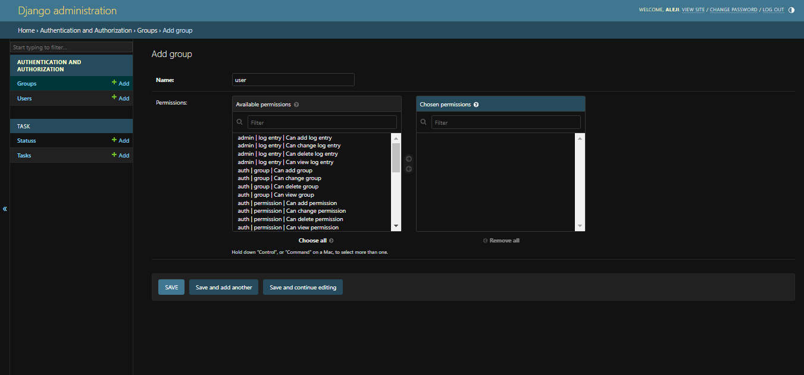 

Y vamos a agregarle el permiso de can_view_task


Luego el grupo ```admin``` y le agregamos todos los permisos

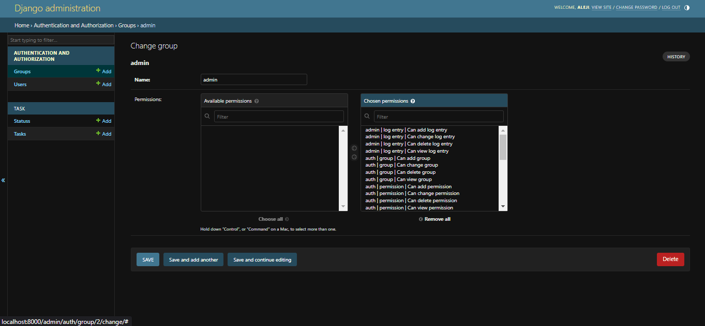

Ahora vamos a modificar nuestro registro para que se haga según los grupos que creamos

```py
def register(request):
    if request.method == "POST":
        username = request.POST["username"]
        email = request.POST["email"]
        password1 = request.POST["password1"]
        password2 = request.POST["password2"]

        if password1 != password2:
            messages.error(request, "Las contraseñas no coinciden")
        elif User.objects.filter(username=username).exists():
            messages.error(request, "El usuario ya existe")
        else:
            user = User.objects.create_user(username=username, email=email, password=password1)

            # Asignar grupo "Usuarios" automáticamente
            user_group, created = Group.objects.get_or_create(name="Usuarios")
            user.groups.add(user_group)

            login(request, user)
            messages.success(request, "¡Registro exitoso!")
            return redirect("list-tasks")

    return render(request, "auth/register.html")
```

Seran necesarios los siguientes imports

```py
from django.contrib.auth.models import Group
from django.shortcuts import render, redirect
from django.contrib.auth.forms import UserCreationForm
from django.contrib import messages
```

ahora podemos proteger nuestras rutas por permisos

```
from django.contrib.auth.decorators import permission_required

@permission_required("task.add_task", raise_exception=True)
```

Ahora si creamos un usuario y nos logueamos, luego tratamos de crear una tarea 

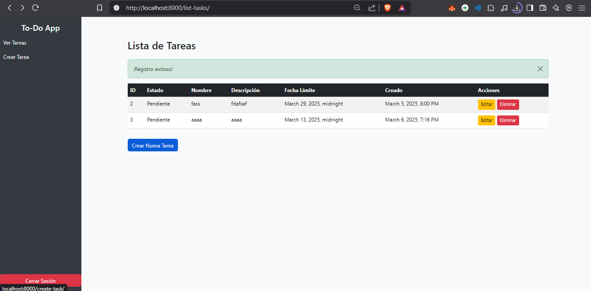

nos encontramos con lo siguiente

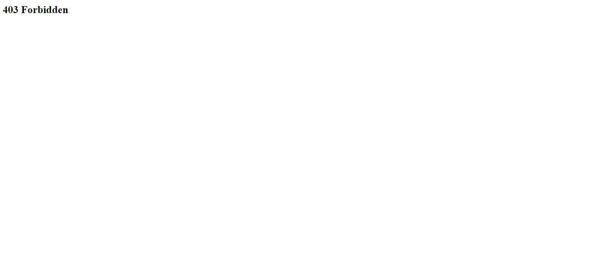

Pero si nos logueamos con las credenciales de admin sucede lo siguiente

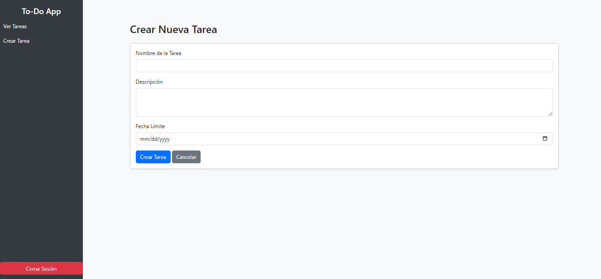

Funciona normal

### Manejo de roles

Para hacer funcionalidades segun los roles tenemos que hacer una funcion para verificar que mi usuario pasa un filtro
definido por una función en esta caso vamos a verificar si es admin, es decir, si es superuser o pertenece al grupo
```admin``` que creamos esto en ```views.py```

```py
def is_role_admin(user):
    return user.groups.filter(name="admin").exists() or user.is_superuser
```

Ahora podemos usar el decorador ```@user_passes_test()``` para restringir solo los usuario que cumplane esa condición
vamos a hacer una vista para gestionar los roles

```py
@login_required
@user_passes_test(is_role_admin)  # Solo admins pueden acceder
def manage_roles(request):
    users = User.objects.all()
    groups = Group.objects.all()

    if request.method == "POST":
        user_id = request.POST.get("user_id")
        group_id = request.POST.get("group_id")
        action = request.POST.get("action")

        user = User.objects.get(id=user_id)
        group = Group.objects.get(id=group_id)

        if action == "add":
            user.groups.add(group)
            messages.success(request, f"Se añadió {user.username} al grupo {group.name}.")
        elif action == "remove":
            user.groups.remove(group)
            messages.warning(request, f"Se eliminó {user.username} del grupo {group.name}.")

        return redirect("manage-roles")

    return render(request, "roles/manage_roles.html", {"users": users, "groups": groups})
```
Y agregamos los imports
```py
from django.contrib.auth.decorators import login_required, user_passes_test
```

ahora en ```role/manage_roles.html``` agregamos el html

```html



<div class="container mt-5">
    <h2 class="mb-4">Administrar Roles</h2>

    
        
            <div class="alert alert-{{ message.tags }} alert-dismissible fade show">
                {{ message }}
                <button type="button" class="btn-close" data-bs-dismiss="alert"></button>
            </div>
        
    

    <div class="row">
        <div class="col-md-6">
            <h4>Usuarios</h4>
            <table class="table table-bordered">
                <thead class="table-dark">
                    <tr>
                        <th>Usuario</th>
                        <th>Roles</th>
                        <th>Acciones</th>
                    </tr>
                </thead>
                <tbody>
                    
                    <tr>
                        <td>{{ user.username }}</td>
                        <td>
                            
                                <span class="badge bg-info">{{ group.name }}</span>
                            
                                <span class="text-muted">Sin rol</span>
                            
                        </td>
                        <td>
                            <form method="post" class="d-inline">
                                
                                <input type="hidden" name="user_id" value="{{ user.id }}">
                                <select name="group_id" class="form-select form-select-sm d-inline w-auto">
                                    
                                        <option value="{{ group.id }}">{{ group.name }}</option>
                                    
                                </select>
                                <button type="submit" name="action" value="add" class="btn btn-success btn-sm">Añadir</button>
                                <button type="submit" name="action" value="remove" class="btn btn-danger btn-sm">Quitar</button>
                            </form>
                        </td>
                    </tr>
                    
                </tbody>
            </table>
        </div>
    </div>
</div>

```

Y agregamos la ruta en ```urls.py```

```py
    path("admins/roles/", views.manage_roles, name="manage-roles"),
```

Con esto, si nos logueamos como admin o superusuario y vamos a ```http://localhost:8000/admins/roles/``` podemos acceder a la pantalla

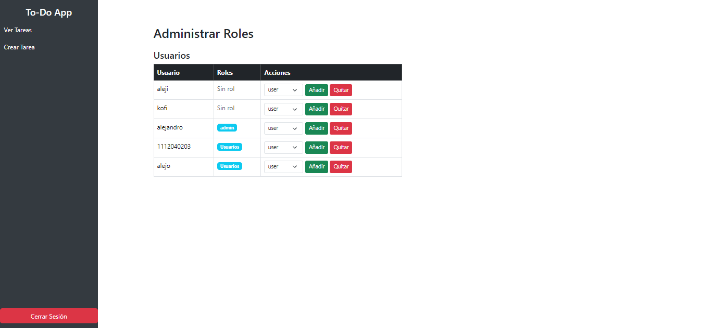

Y manejar los roles por ahi

### Manejo de permisos por tarea

Primero vamos a crear en nuestra app un archivo ```signals.py``` para manejar la creacion de permisos cada que se
cree una tarea

```py
from django.db.models.signals import post_save
from django.dispatch import receiver
from django.contrib.auth.models import Permission
from django.contrib.contenttypes.models import ContentType
from .models import Task

@receiver(post_save, sender=Task)
def create_task_permissions(sender, instance, created, **kwargs):
    if created:
        content_type = ContentType.objects.get_for_model(Task)

        view_perm = Permission.objects.create(
            codename=f'view_task_{instance.id}',
            name=f'Puede ver la tarea {instance.name}',
            content_type=content_type
        )

        edit_perm = Permission.objects.create(
            codename=f'edit_task_{instance.id}',
            name=f'Puede editar la tarea {instance.name}',
            content_type=content_type
        )

        delete_perm = Permission.objects.create(
            codename=f'delete_task_{instance.id}',
            name=f'Puede eliminar la tarea {instance.name}',
            content_type=content_type
        )

        print(f"Permisos creados para la tarea {instance.name}: {view_perm.codename}, {edit_perm.codename}, {delete_perm.codename}")
```

Ahora en ```apps.py``` vamos a agregar este metodo dentro de ```TaskConfing```

```py
    def ready(self):
        import task.signals  
```

Ahora vamos a hacer una vista, para que el admin pueda manejar quien puede acceder de que forma a que tarea

Creamos la vista

```py
@login_required
def assign_permissions(request):
    tasks = Task.objects.all()
    users = User.objects.all()

    if request.method == "POST":
        user_id = request.POST.get("user_id")
        task_id = request.POST.get("task_id")
        permission_type = request.POST.get("permission_type")

        user = User.objects.get(id=user_id)
        permission = Permission.objects.get(codename=f"{permission_type}_task_{task_id}")
        print("se le agrego al usuario el permiso")
        print(f"{permission_type}_task_{task_id}")
        user.user_permissions.add(permission)

    return render(request, "assign_permissions.html", {"tasks": tasks, "users": users})
```

Ahora creamos el template ```assign_permissions.html```

```html



<div class="container mt-5">
    <h2>Asignar Permisos</h2>

    <form method="POST">
        
        <div class="mb-3">
            <label for="user_id" class="form-label">Selecciona un usuario:</label>
            <select name="user_id" class="form-control">
                
                    <option value="{{ user.id }}">{{ user.username }}</option>
                
            </select>
        </div>

        <div class="mb-3">
            <label for="task_id" class="form-label">Selecciona una tarea:</label>
            <select name="task_id" class="form-control">
                
                    <option value="{{ task.id }}">{{ task.name }}</option>
                
            </select>
        </div>

        <div class="mb-3">
            <label for="permission_type" class="form-label">Tipo de Permiso:</label>
            <select name="permission_type" class="form-control">
                <option value="view">Ver</option>
                <option value="edit">Editar</option>
                <option value="delete">Eliminar</option>
            </select>
        </div>

        <button type="submit" class="btn btn-primary">Asignar Permiso</button>
    </form>
</div>

```

Y agregamos la ruta

```py
    path("assign-permissions/", views.assign_permissions, name="assign-permissions"),
```

Ahora tenemos que modificar la lógica de mostrar las listas para hacerlo en función de los parámetros
Modificamos la vista

```py
@login_required
def list_tasks(request):
    tasks = Task.objects.all()
    print(request.user.get_all_permissions())

    filtered_tasks = []
    for task in tasks:
        perm_view = f"task.view_task_{task.id}"
        perm_edit = f"task.edit_task_{task.id}"
        perm_delete = f"task.delete_task_{task.id}"
        print(perm_view)
    
        if request.user.has_perm(perm_view):
            print("tiene edit")
            print(request.user.has_perm(perm_edit))
            # Agregar permisos específicos a la tarea
            task.can_edit = request.user.has_perm(perm_edit)
            task.can_delete = request.user.has_perm(perm_delete)
            filtered_tasks.append(task)

    return render(request, "list_tasks.html", {"tasks": filtered_tasks})
```

y modificamos el template de ```list_tasks.html```

```html



<!DOCTYPE html>
<html lang="es">
<head>
    <title>Lista de Tareas</title>
</head>
<body class="bg-light">

    <div class="container mt-5">
        <h2 class="mb-4">Lista de Tareas</h2>

        
        <div class="table-responsive">
            <table class="table table-striped table-hover">
                <thead class="table-dark">
                    <tr>
                        <th>ID</th>
                        <th>Estado</th>
                        <th>Nombre</th>
                        <th>Descripción</th>
                        <th>Fecha Límite</th>
                        <th>Creado</th>
                        <th>Acciones</th>
                    </tr>
                </thead>
                <tbody>
                    
                    <tr>
                        <td>{{ task.id }}</td>
                        <td>{{ task.status_id.name }}</td>
                        <td>{{ task.name }}</td>
                        <td>{{ task.description }}</td>
                        <td>{{ task.deadline|default:"No definida" }}</td>
                        <td>{{ task.created_at|date:"F j, Y, g:i A" }}</td>
                        <td>
                            
                                <a href="" class="btn btn-warning btn-sm">Editar</a>
                            
                            
                            
                                <button class="btn btn-danger btn-sm" data-bs-toggle="modal" data-bs-target="#deleteModal" data-task-id="{{ task.id }}">
                                    Eliminar
                                </button>
                            
                        </td>
                    </tr>
                    
                </tbody>
            </table>
        </div>
    
        <div class="alert alert-info">No tienes permiso para ver ninguna tarea.</div>
    
    
        <a href="" class="btn btn-primary mt-3">Crear Nueva Tarea</a>
    </div>

    <!-- Modal de confirmación de eliminación -->
    <div class="modal fade" id="deleteModal" tabindex="-1" aria-hidden="true">
        <div class="modal-dialog">
            <div class="modal-content">
                <div class="modal-header">
                    <h5 class="modal-title">Confirmar eliminación</h5>
                    <button type="button" class="btn-close" data-bs-dismiss="modal"></button>
                </div>
                <div class="modal-body">
                    <p>¿Estás seguro de que quieres eliminar esta tarea?</p>
                </div>
                <div class="modal-footer">
                    <form id="delete-form" method="POST">
                        
                        <button type="submit" class="btn btn-danger">Eliminar</button>
                    </form>
                    <button type="button" class="btn btn-secondary" data-bs-dismiss="modal">Cancelar</button>
                </div>
            </div>
        </div>
    </div>

    <script>
        document.addEventListener("DOMContentLoaded", function() {
            var deleteModal = document.getElementById("deleteModal");

            deleteModal.addEventListener("show.bs.modal", function(event) {
                var button = event.relatedTarget;  
                var taskId = button.getAttribute("data-task-id");

                var form = document.getElementById("delete-form");
                form.action = `/delete-task/${taskId}/`;
            });
        });
    </script>

</body>
</html>


```

Ahora solo se podran, ver, editar, y eliminar las tareas a las que se tenga ese permiso, recuerden eliminar
las tareas que hayan creado hasta este punto, porque esas no tienen permisos aun, entonces les genera
un error si intentan asignarlo


Aqui hicimos la logica de los permisos de manera visual, pero las acciones son aun accesibles por ruta
entonces debemos cambiar la logica de editar y de eliminar

```py
@login_required
def edit_task(request, task_id):
    task = get_object_or_404(Task, id=task_id)

    if not request.user.has_perm(f"task.change_task_{task.id}"):
        raise PermissionDenied("No tienes permiso para editar esta tarea.")
    if request.method == 'POST':
        task: Task = Task.objects.get(id=task_id)

        task.name = request.POST.get('task-name', '')
        task.description = request.POST.get('task-description', '').strip()

        deadline_str: str = request.POST.get('task-deadline', '').strip()
        deadline: datetime.datetime = None

        if deadline_str:
            try:
                deadline = datetime.datetime.strptime(deadline_str, '%Y-%m-%d')

            except ValueError:
                pass

        task.deadline = deadline
        task.save()

        messages.success(request, '¡Tarea actualizada exitosamente!')

        return redirect('list-tasks')

    return render(request, 'edit_task.html', {
        'task': Task.objects.get(id=task_id),
        'task_statuses': Status.objects.all(),
    })

@login_required
def delete_task(request, task_id):
    task = get_object_or_404(Task, id=task_id)

    if not request.user.has_perm(f"task.delete_task_{task.id}"):
        raise PermissionDenied("No tienes permiso para eliminar esta tarea.")
    Task.objects.get(id=task_id).delete()

    messages.success(request, '¡Tarea eliminada exitosamente!')

    return redirect('list-tasks')
```

y agregar estos imports

```py
from django.shortcuts import get_object_or_404
from django.contrib.auth.decorators import login_required, permission_required
from django.core.exceptions import PermissionDenied
from .models import Task
```# djangoTodo
